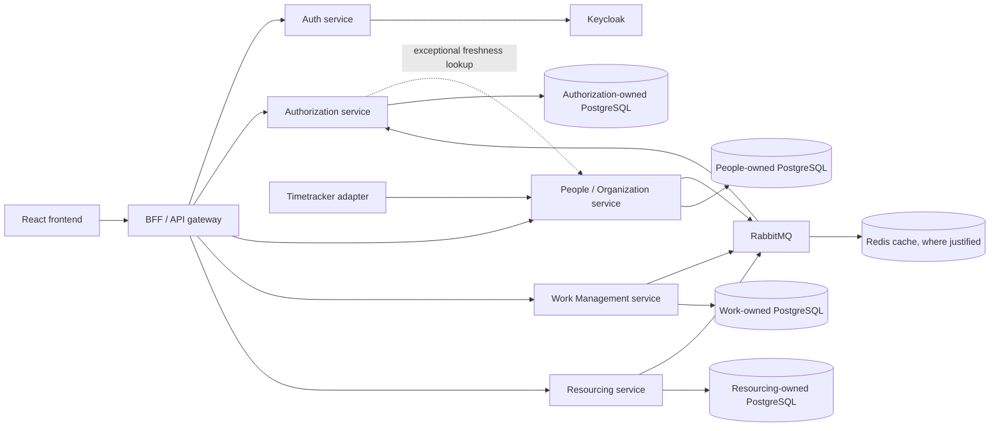
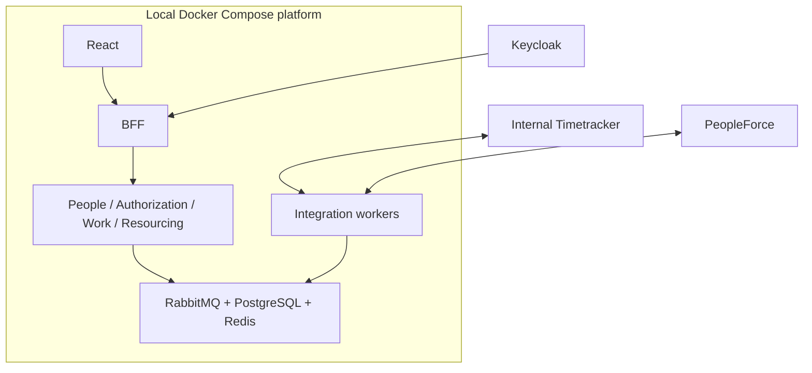

# Architecture Spine — People Management Platform

## Design Paradigm

The platform uses service-oriented bounded contexts in one monorepo. Each service keeps domain
logic behind explicit application and API/adapter boundaries; services communicate through
versioned REST/JSON APIs or RabbitMQ events, never through another service's persistence layer.

The initial boundaries are deliberately thin and pragmatic. Independent deployment is supported,
but local development and the first delivery scope use one shared Docker Compose platform.

## Invariants & Rules

### AD-1 — Bounded contexts own their domains

- **Binds:** all domain capabilities
- **Prevents:** duplicated ownership, cross-service table coupling, and incompatible domain models
- **Rule:** People/Organization owns profiles, employment history, organization structure,
  reporting lines, departments, projects, assignments, People Partner relationships,
  cross-system identity links, custom-field definitions/values, system dictionaries, and
  authoritative organizational relationships. It also owns the career-timeline record store and
  manual timeline overrides; domain services publish events that cause timeline entries where
  appropriate. Work Management owns risks, action items, CDS, mentorship, campaigns, and
  feedback. Resourcing owns requests, candidates, proposals, approvals, request history, and
  resourcing-specific workflow state. Integration services own adapters and genuinely
  integration-owned normalized records only.

### AD-2 — Authorization is a separate policy boundary

- **Binds:** FR-1..FR-7, FR-20, FR-25..FR-30, FR-39, NFR-access-control
- **Prevents:** functional roles being mistaken for data access and client-side or distributed
  permission decisions
- **Rule:** Authorization owns access-role resolution, functional permissions, and section,
  record, and operation policy decisions. Functional permissions are stored runtime data.
  Access roles are derived per viewer/subject/request from relationship inputs. No other service
  may replace this with a hardcoded role-name check.

### AD-3 — Authorization uses a derived relationship projection

- **Binds:** FR-1, FR-2, FR-4..FR-7, FR-20, FR-25..FR-30, FR-39, ADR-001
- **Prevents:** synchronous People calls on every request and stale access surviving silently
  after a relationship revocation
- **Rule:** People/Organization is authoritative for relationships. Authorization owns only the
  derived projection needed for policy evaluation. RabbitMQ is the normal synchronization path.
  Relationship changes are published through transactional outboxes; events carry an event id,
  source aggregate/version, occurred-at timestamp, schema version, and whether the change grants
  or revokes access. Revocations receive priority propagation and fail-closed handling while
  freshness is uncertain. Authorization records applied source versions and projection
  freshness/watermarks, rejects stale or out-of-order updates, and supports replay. A
  synchronous People lookup is an exceptional freshness check or fallback, not the default
  request path. **The propagation bound is fixed, not open:** project-derived access changes
  within **15 minutes of the underlying Timetracker assignment change** under normal sync —
  the clock starts at the provider-side assignment change, not at poll time, diff detection,
  or internal event publication — degrading to a forced withdrawal within **4 hours** if
  timetracker sync itself is failing; platform-owned relationship edits (reporting line,
  department, PP assignment) take effect on the requester's next request rather than through this
  propagation path (`.claude/rules/access-control-invariants.md`). API visibility delay, polling
  cadence, adapter processing, outbox publication, projection update, and cache invalidation
  must together fit within that 15-minute bound; if the supplied provider contract cannot
  support it, treat that as an integration feasibility issue — do not weaken the requirement.

### AD-4 — Persistence ownership is isolated

- **Binds:** all service data
- **Prevents:** hidden coupling through shared PostgreSQL tables and untraceable mutations
- **Rule:** PostgreSQL is the primary store. Each bounded context owns its database or schema.
  Services may initially share one physical PostgreSQL instance, but may not directly read or
  write another service's tables. Cross-service access uses explicit APIs, contracts, or events.
  Each service owns and runs its own migrations.

### AD-5 — The BFF is the browser boundary, not a domain owner

- **Binds:** frontend integration and profile/list/dashboard responses
- **Prevents:** domain rules leaking into the frontend or the BFF becoming a second policy engine
- **Rule:** React communicates through the BFF/API gateway. The BFF validates Keycloak-issued
  authentication, adds correlation context, calls and composes domain APIs, and returns
  consistent errors. It must not own authorization policy or bypass the Authorization Service.
  Restricted sections and fields are omitted server-side before reaching React.

### AD-6 — Cross-service messages are durable and replay-safe

- **Binds:** integrations, background workflows, relationship propagation, and domain events
- **Prevents:** lost events, duplicate side effects, poison-message loops, and incompatible
  consumers
- **Rule:** RabbitMQ carries versioned message contracts. Consumers have independent queues,
  process messages idempotently, retry failures, dead-letter unprocessable messages, and support
  safe replay. Authoritative producers use transactional outboxes for published domain events.

### AD-7 — Delivery quality gates protect the access model

- **Binds:** NFR-access-control, NFR-performance, NFR-availability, NFR-accessibility
- **Prevents:** shipping an apparently working feature with unverified authorization or broken
  integration behavior
- **Rule:** CI runs builds, unit tests, service integration tests, API contract tests, migration
  validation, and focused end-to-end tests. A machine-readable authorization coverage manifest
  must cover every section-matrix audience/relationship-path combination, every `—` cell,
  operation-level R/RW case, S7 flag-gating, colleague whitelist, shared-link restriction, and
  custom-field visibility case; CI fails for uncovered cells. Revocation tests cover reporting
  line and project-assignment endings, outbox atomicity, duplicate/reordered events, replay,
  stale-projection denial, and removal within the approved propagation bound. Integration tests
  cover timeouts, 5xx responses, malformed payloads, stale-but-labeled data, and per-candidate
  PeopleForce fallback. Contract checks enforce OpenAPI/message schema compatibility. Migration
  checks cover clean apply and upgrade paths, and the performance gate is p95 <= 2 seconds for
  500+ employees with permission resolution. Integration failures degrade safely and never grant
  unauthorized access.

### AD-8 — Shared profile views are authorization-owned grants

- **Binds:** FR-29..FR-30, profile sharing, resourcing candidate review
- **Prevents:** a share link becoming an alternate permission system or granting unintended write
  and sensitive-section access
- **Rule:** Authorization owns share grants and their policy state; the BFF exposes the flow and
  domain services request decisions. A grant identifies its subject, recipient, allowed-section
  allowlist, creator, expiry, revocation state, and access log. S2, S5, S6, and S8 are excluded
  by default; S3, S7, and S13 are never shareable. Every access is logged, expiry and revocation
  are enforced server-side, and a shared grant is read-only regardless of its sections.

### AD-9 — Cross-service contracts evolve compatibly

- **Binds:** APIs, RabbitMQ messages, independent deployment
- **Prevents:** independently deployable services disagreeing on required fields, event ordering,
  tombstones, or replay behavior
- **Rule:** Shared contracts are versioned and owned in `libs/contracts` (or an explicitly
  designated contract package). OpenAPI and message schemas use backward-compatible additive
  evolution within a version; breaking changes require a new version and a migration plan.
  Producers and consumers verify compatibility in CI, and event consumers tolerate duplicate,
  delayed, and replayed messages.

### AD-10 — Visibility is enforced before query and composition

- **Binds:** FR-4, FR-7..FR-12, NFR-access-control, exports, search, notifications, list columns
- **Prevents:** hidden-field inference through filters, sorting, exports, search, composed payloads,
  or client-side omission
- **Rule:** Every surface that can return or use profile data obtains an Authorization decision
  before querying/composing that section or field. Custom-field visibility is enforced for values,
  filters, sorting, list columns, exports, and search. Colleague responses are constructed from
  the exact S1/S10/S11 whitelist. A denied section or field is absent from the response and from
  error or notification content.

### AD-11 — Timetracker adapter ingests state and publishes internal relationship changes

- **Binds:** FR-43, FR-44, SM-2, AD-1, AD-3, AD-6
- **Prevents:** treating provider retrieval as native events, granting project-derived access on
  unverified identity, inferring assignment removal from incomplete responses, and weakening the
  fixed propagation bounds
- **Rule:** Under the supplied TimeTracker External API contract v1.0.0,
  `integration-timetracker` retrieves project and team-member state through
  `GET /api/projects/talents` (and leave-related state through the documented
  `POST /api/accounting/report` endpoint). That contract documents no provider events or webhooks; the architecture makes no
  claim that the provider lacks undocumented or future event capability — only that platform
  ingestion for this iteration is state retrieval, not provider push. The adapter diffs retrieved
  state against the last successful snapshot and causes People/Organization to publish a
  **provider-neutral internal normalized relationship-change contract** through its transactional
  outbox (AD-3, AD-6). The stub producer built in Epic 1 and the real adapter must publish the
  **same internal contract**; Authorization consumes only that contract, never raw provider
  payloads. Persist Timetracker `Employee.id` as an opaque provider-scoped external identifier;
  do not assume immutability or non-reuse; do not use `Employee.hash` for identity.
  `AccountTalentDto.email` is a lookup attribute only — email alone never verifies or activates
  a link. Project-derived access requires an explicitly verified `Employee.id`-to-`person_id`
  mapping owned by People/Organization (AD-1); missing, ambiguous, stale, or unverified mappings
  **fail closed** — no project-line access for that member. Unresolved `projectManager` and
  `deliveryManager` strings cannot grant access until their identity semantics are confirmed.
  Do not treat absence from a response as assignment removal until response completeness,
  pagination, and provider removal semantics are confirmed; only positively evidenced changes
  may produce internal grant or revoke events. PeopleForce candidate-to-employee lifecycle
  linkage remains deferred from v1.5; store the PeopleForce candidate ID as the candidate-side
  anchor only (FR-45).

### Dependency direction



## Consistency Conventions

| Concern | Convention |
| --- | --- |
| Naming | Domain-oriented service and event names; explicit API and message versions; stable identifiers across contracts; no role-name constants as policy checks |
| Data & formats | REST/JSON APIs described by OpenAPI; versioned contracts; ISO 8601 timestamps; consistent structured error envelope; service-owned PostgreSQL migrations; pseudonymized non-production data |
| State & cross-cutting | Auth service validates Keycloak-issued identity at the edge; server-side section authorization; transactional outbox; idempotent consumers; retries and dead letters; correlation IDs in structured logs; fail closed on authorization uncertainty |
| Caching | Redis only where a measured need justifies it; never the system of record; authorization caches must not preserve revoked access beyond the approved propagation bound |
| Testing | Unit, service integration, API contract, migration, and focused end-to-end tests; authorization matrix tests assert API-level inclusion and exclusion |

## Stack

| Name | Version |
| --- | --- |
| React | Approved frontend; version must be verified and centrally pinned before implementation |
| Node.js / TypeScript | Approved core business-service runtime; versions must be verified and centrally pinned before implementation |
| .NET | Approved Authorization Service runtime; version must be verified and centrally pinned before implementation |
| Keycloak | Approved identity provider; deployment version must be verified and pinned before implementation |
| PostgreSQL | Approved primary data store; deployment version must be verified and pinned before implementation |
| RabbitMQ | Approved message broker; deployment version must be verified and pinned before implementation |
| Redis | Approved cache where justified; deployment version must be verified and pinned before implementation |
| Docker Compose | Approved initial local orchestration; image versions must be verified and pinned in infrastructure configuration |

## Structural Seed

```text
repository-root/
  docs/
    decisions/                 # ADRs for cross-boundary decisions
    access-control/            # living section matrix and coverage
    integrations/              # external API research and decisions
  infra/
    docker-compose.yml         # local platform and shared infrastructure
  libs/
    contracts/                 # versioned cross-service API/message contracts
    config/                    # shared Node service tooling configuration
  services/
    frontend/                  # React application
    bff/                       # browser-facing composition boundary
    auth-service/               # Keycloak integration and identity plumbing
    authorization-service/      # .NET policy and derived relationship projection
    people-service/             # People/Organization authoritative domain
    work-management-service/    # risks, tasks, CDS, mentorship, campaigns, feedback
    resourcing-service/         # requests, candidates, proposals, approvals, history
    integration-timetracker/    # Timetracker adapter
    integration-peopleforce/    # PeopleForce adapter
```



The initial operational baseline is Docker Compose with health/readiness checks, per-service
migrations, structured correlation-aware logs, basic tracing where practical, and separate
development/test profiles as implementation needs them.

## Capability → Architecture Map

| Capability / Area | Lives in | Governed by |
| --- | --- | --- |
| FR-1..FR-7 role resolution and section authorization | Authorization service, with People relationship events | AD-2, AD-3, AD-6 |
| FR-8..FR-15 profiles, list, self-service, custom fields | People/Organization service and BFF | AD-1, AD-4, AD-5 |
| FR-16..FR-19 dashboards | Work Management/Resourcing APIs composed by BFF | AD-1, AD-5 |
| FR-20..FR-24 tasks and risks | Work Management service | AD-1, AD-2, AD-4 |
| FR-25..FR-30 resourcing and profile sharing | Resourcing service plus Authorization decisions | AD-1, AD-2, AD-5 |
| FR-31 timeline and FR-32 manual timeline overrides | People/Organization service; events from People and Work Management | AD-1, AD-4, AD-6 |
| FR-33..FR-38 CDS and mentorship | Work Management service, with timeline events consumed by People/Organization | AD-1, AD-4, AD-6 |
| FR-39..FR-42 campaigns and feedback | Work Management service | AD-1, AD-2, AD-5 |
| FR-43..FR-45 Timetracker and PeopleForce | Integration workers through explicit service APIs/events | AD-1, AD-6, AD-7, AD-11 |
| NFR and definition of done | All services, infra, and CI | AD-3, AD-6, AD-7 |

## Deferred

- Exact framework/library versions and integration-worker runtime; pin them in implementation
  baselines only after verifying current compatibility and recording the central compatibility
  baseline.
- Exact RabbitMQ exchange, routing-key, queue, retry, and dead-letter topology.
- Freshness telemetry, alert thresholds, and the operational procedure for projection
  rebuild/replay. (The revocation propagation bound itself — 15 minutes from the underlying
  Timetracker assignment change, 4-hour forced withdrawal on sync failure — is fixed in AD-3
  and AD-11, not open.)
- Timetracker polling cadence, documented rate limits, API visibility delay, response
  completeness, pagination behavior, and provider removal semantics (including whether absence
  from a response means assignment removal).
- Timetracker `projectManager` and `deliveryManager` string identity semantics and multiplicity.
- Timetracker `Employee.id` lifecycle properties (immutability, non-reuse).
- The operational workflow for creating, explicitly verifying, auditing, deactivating, and
  resolving conflicts in Timetracker `Employee.id`-to-`person_id` mappings.
- The exact mechanism for detecting a four-hour sync-failure window for forced access withdrawal.
- PeopleForce candidate-to-employee lifecycle linkage (deferred from v1.5; candidate ID
  persistence is in scope).
- Deployment provider, production topology, secret-management implementation, and full
  observability platform; the initial scope owns local Compose and proportional CI only.
- Whether any bounded context should split into additional deployable services after usage and
  team ownership justify it.
- Detailed API resource shapes, event schemas, database attributes, and frontend component tree;
  these belong to contracts and implementation, subject to the invariants above.
